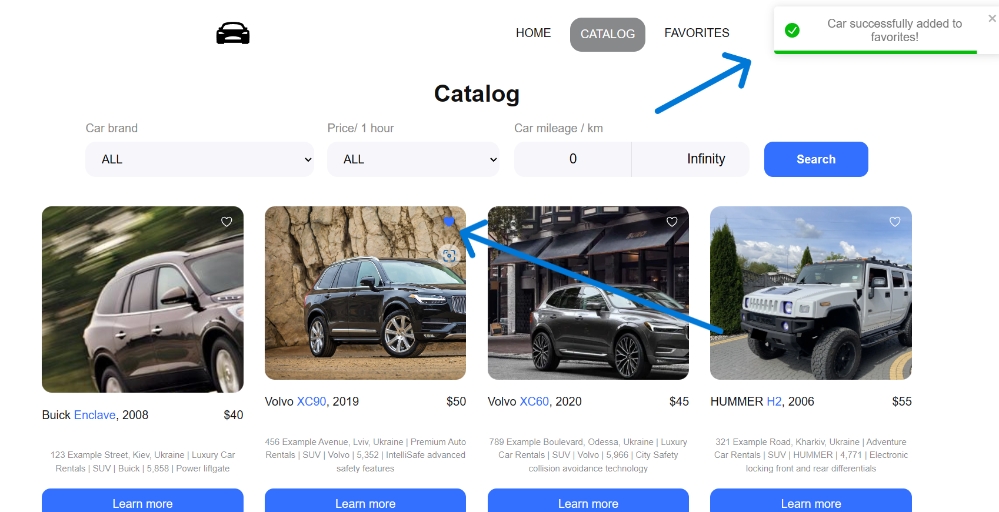

# CarRental Ukraine

Welcome to CarRental Ukraine – Your Ultimate Destination for Hassle-Free Car
Rentals!

CarRental Ukraine is a user-friendly car rental platform designed to make your
travel experience seamless. From a diverse selection of cars to easy online
booking, we've got you covered. This README provides essential information to
get you started.

# Features Exclusive Car Selection:

Choose from a variety of cars, from economy to luxury.

# Favorites:

Save your preferred cars for future reference.

# Transparent Booking:

Clear and competitive pricing with no hidden costs.

# Prerequisites

To run the website locally, ensure you have the following installed:

Web browser (Chrome, Firefox, Safari, etc.) Internet connection Installation No
installation is required to access the CarRental Ukraine website. Simply visit
[https://violetanaboy.github.io/CarRental/] to get started.

# Usage

1. Visit the RentDrive Ukraine website.

2. Browse the car catalog.

3. Choose your desired car.

4. Add it to your "Favorites" if needed.

5. Book the car online.

6. Pick up the car at your chosen location or opt for delivery.
7. Enjoy your journey!
